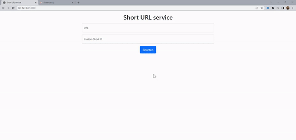

# Short Url Application
Service to shorten url
-----------------------------------------------------------------------------------
This application takes long URLs and gives a shorter version of the URL. 
We store the short and long URLs in a DataBase and redirect accordingly.
-----------------------------------------------------------------------------------

Instructions to run the application:
1. Clone the repo using `git clone https://github.com/Vish-Yadlapalli/shortUrl.git`
2. Adjust the environment variables in `.env` file to match the DB you are using. 
3. Run `flask run` on your terminal to run the application locally

    

-----------------------------------------------------------------------------------
Future Work: 
- Add tests
- Admin functionality to manage links
- Authentication to access admin panel
- Dockerize the application to minimize environment issues
